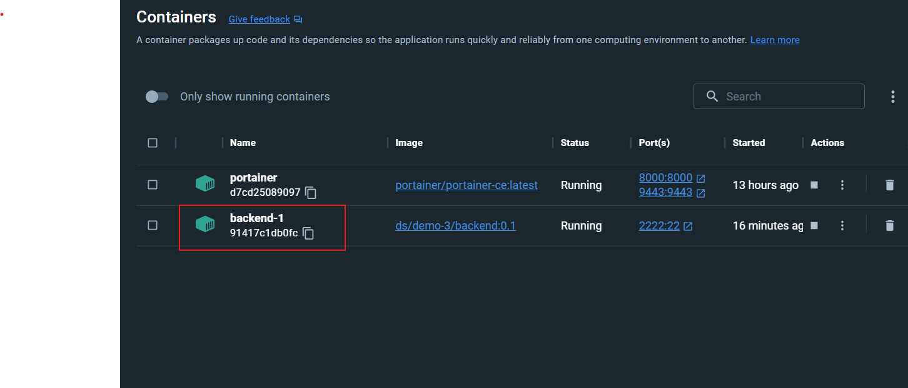
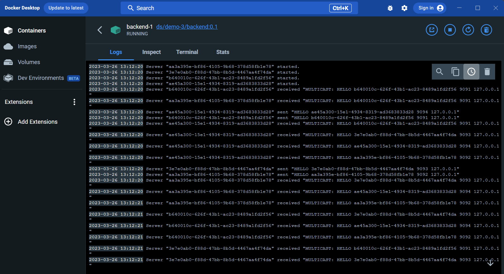

# PSI - úloha 1
Hana Hrkalová

25.3.2023

## Přeložení a spuštění programu
Projekt PriorityComunication je napsán v jazyce Java.

V adresáři *dsa-hrkalova-uloha1* se program spustí příkazem *vagrant up*
(Pokud by se projekt nespustil, je třeba ukončit příkaz a zavolat vagrant up znovu.)

Poté se zobrazí kontejner *backend-1*, v apliakci docker. Po rozkliknutí konjteneru jsou vidět v záložce *logs* zprávy o volbě vedoucího uzlu a komunikaci mezi ostatními.

### Kontejner v dockeru

### Logy kontejneru

## Popis programu

Program simuluje výběr vedoucího uzlu z několika možných.

Počet uzlů je dán staticky, bylo by možné jej programově upravit, pro simulaci funkce volby to ovšem stačí.

Program neřeší výpadky uzlů, pouze zajišťuje volbu vedoucího uzlu v konečném čase.

### Způsob volby
Rozhodla jsem se volbu vedoucího uzlu udělat zjednodušeným prinicpem Raftu, který jsme si ukazovali na DSA.

Každý uzel má svůj náhodný časový intevral mezi 0,5 a 5 vteřinami.
Poté co prvnímu uzlu doběhne jeho časový interval, zkontroluje zda může odesílat žádost o vedení (pokud už on sám neobdržel žádost o vedení od jiného uzlu). Pokud neobdržel žádnou zprávu, odešle pomocí multicastu všem ostantím uzlům zprávu o tom, že chce být vedoucí uzel.

Pokud dostane souhlas od většiny (alespoň poloviny) uzlů (komunikace mezi požadujícím uzlem a uzlem, který odpovídá zpět, je pouze unicastová), stává se vedoucím celé skupiny.

### Udržování kontaktu
Uzly spolu komunikují pomocí heartbeats jako v Raftu, tedy, posílají si v krátkém časovém intervalu dotaz (ping), zda je možné komunikovat s vedoucím uzlem.

### Běh programu
Simulace se spouští automaticky, po spuštění programu. Není nastavený konec této simulace, uzly spolu budou komunikovat, dokud uživatel neukončí program.

## Struktura projektu
Program je rozdělen na spouštěcí třídu a balík dsa, obsahující zbylé třídy.
### Main
Hlavní spouštěcí třída, obsahující definovaný port a timeout. Vytvoří daný počet uzlů (konkrétně 4), které následně spustí.

### ExtendedNodeInfo
Dědí ze třídy NodeInfo.
Slouží pro rozšířený popis a uložení proměnných daného uzlu. Obsahuje port, adresu,informaci o tom, jestli dovolil uzlu být vedoucím (vedoucí pak tuto informaci používá pro výpočet vetšiny) a informaci o poslední aktivitě.

### InputMessage
Slouží pro unicastovou komunikaci. Drží informaci o přijaté zprávě, portu a adrese odesílatele.
### MulticastCommunication
Balík pro komunikaci multicastu.
### NodeInfo
Drží základní informace o uzlu, konkrétně id, stav a počet hlasů.
### Server
Obsahuje logiku celého uzlu. Je definován jako vlákno (dědí z Runnable, může jich běžet více).
### ServerState
Pouze výčet typů, kterých může uzel nabývat: vedoucí, následovník a kandidát na vedoucího.

### ServerUtils
Vytváří náhodnost časových intervalů.
### UnicastCommunication
Balík pro komunikaci unicastu.

## Popis výpisu

#### Start uzlu
    Server "17a0e899" started.
#### Multicastové nalezení uzlů mezi sebou
    Server "d8547414" sent "HELLO d8547414 9093 127.0.0.1"
#### Uzel přijmul zprávu z multicastu (ví o jednom uzlu)
Tato zprává přijde od všech při začátku simulace, aby o sobě věděli všechny uzly.

    Server "d8547414" received "MULTICAST: HELLO 25ed5e97 9091 127.0.0.1"

#### Uzlu doběhl časový interval, bude dále rozhodovat zda se bude snažít stát vedoucím

    Server "17a0e899" ended waiting

#### Server se rozhodl poslat zprávu o tom, že chce být vedoucí
    Server "17a0e899" sent "CANDIDATE 17a0e899"

#### Uzel obdržel zprávu o tom, že jiný chce být kandidát
    Server "25ed5e9" received "MULTICAST: CANDIDATE 17a0e899"

#### Uzel jinému schválil kandidaturu
    Server "25ed5e97" - voted for "17a0e899"

#### Kandidující uzel přijmul zprávu o schválení jiného
    Server "17a0e899" received "UNICAST: VOTE d8547414 true"

#### Uzel se stal vedoucím
    Server "17a0e899" became leader.

#### Heartbeat vedoucího uzlu (vedoucí posílá zprávu o tom, že žije)
    Server "d8547414" sent "MULTICAST: PING 17a0e899"
#### Heartbeat vedoucího uzlu (nevedoucí uzel přijmul zprávu o tom, že vedoucí uzel žije)
    Server "d8547414" recieved "MULTICAST: PING 17a0e899"
#### Heartbeat nevedoucího uzlu (nevedoucí uzel odpověděl vedoucímu zpět, že žije)
    Server "d8547414" sent "UNICAST: PING 17a0e899"

